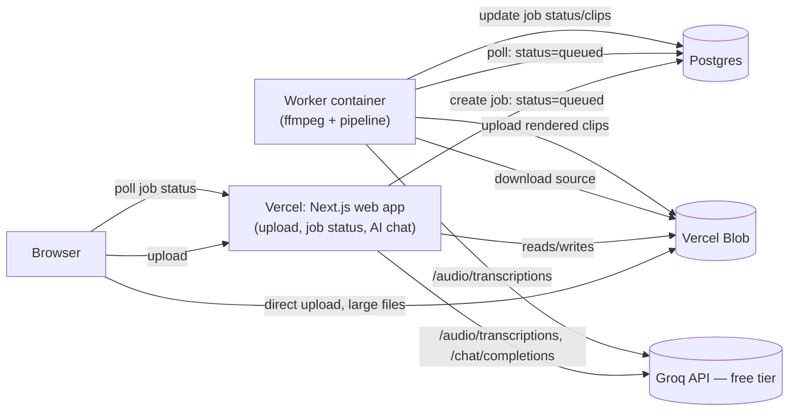

# Architecture

Clip Studio turns a long video into short, captioned clips: transcribe → pick clip-worthy
moments → render (captions, trimming, watermark, multiple formats) → serve back to the browser.

## Why two deployments

The rendering pipeline spawns real `ffmpeg`/`ffprobe` processes and, in local dev, uses ffmpeg's
experimental `whisper` audio filter for transcription. Neither runs on Vercel: serverless functions
there don't ship ffmpeg, can't reliably run long-lived child processes, and have no persistent disk.
So the app splits into two independently deployed pieces that share one database and one blob store:

- **Vercel web app** (`app/`) — upload UI, job status/history API, and the AI chat API
  (`app/api/chat`). Never touches ffmpeg. Large video uploads go straight from the browser to
  Vercel Blob (`app/api/upload/token`) since Vercel's serverless functions cap request bodies well
  below typical video file sizes.
- **Worker** (`worker/index.ts`, `Dockerfile.worker`) — a plain long-running Node process with real
  `ffmpeg` (installed via `apt-get`, no special build needed). Polls Postgres for `status=queued`
  jobs, downloads the source video from Blob, runs the existing pipeline unchanged
  (`lib/video/pipeline.ts`), uploads results back to Blob. Deploy it anywhere that runs a Docker
  container with a persistent process — Railway, Fly.io, Render, a VPS.
- **Groq** (free tier, OpenAI-compatible API) — powers both hosted transcription
  (`TRANSCRIPTION_PROVIDER=hosted-api`, used by the worker) and the in-app chatbot
  (`app/api/chat`), so one free API key covers both.

## Local dev stays zero-config

With no `POSTGRES_URL` / `BLOB_READ_WRITE_TOKEN` set, every adapter below falls back to the
original single-process behavior — `npm run dev` needs nothing beyond an ffmpeg build with
`--enable-whisper` on PATH:

| Concern | Local dev (no env vars) | Production |
|---|---|---|
| Job state | JSON files in `storage/jobs` (`lib/video/job-store.local.ts`) | Postgres via Drizzle (`lib/video/job-store.postgres.ts`) |
| File storage | Local disk, served from `public/generated` (`lib/storage/local.ts`) | Vercel Blob (`lib/storage/blob.ts`) |
| Transcription | ffmpeg's `whisper` audio filter (`lib/video/transcribe.ts`) | Groq's hosted Whisper API |
| Pipeline trigger | Runs in-process right after upload | Worker polls Postgres for queued jobs |

The dispatch is purely environment-variable presence — see `lib/video/job-store.ts` and
`lib/storage/index.ts`.

## AI chatbot (`app/api/chat`)

Scoped to one job at a time, grounded with tool calls (never left to guess): `get_transcript`,
`list_clips`, `explain_clip_score`, and `create_clip` (renders a new clip from a time range the
model picks out of the transcript). Runs on Groq's free tier via the plain `openai` SDK pointed at
Groq's OpenAI-compatible endpoint, so swapping providers later is a `baseURL`/key change, nothing
structural.

**Known scope boundary:** `create_clip` renders synchronously in-process, which requires local
ffmpeg + the source file on the same machine — true in local dev, not true for the Vercel web app in
production (no ffmpeg there). In production the tool currently reports this rather than silently
failing; making it work end-to-end means extending the worker to also watch for pending custom-clip
requests on existing jobs, the same way it watches for new queued jobs.

## Deploying

1. **Database** — create a free Neon Postgres project (or any Postgres). Set `POSTGRES_URL` on both
   the Vercel project and the worker host. Run `npm run db:push` once to create the `jobs` table.
2. **Blob storage** — create a Vercel Blob store from the Vercel dashboard and link it to the
   project (fills in `BLOB_READ_WRITE_TOKEN` for you). Set the same token on the worker host. The
   upload form checks `/api/config` live and switches to direct browser-to-blob uploads
   automatically once this is set — no separate flag or rebuild needed.
3. **Groq** — create a free key at console.groq.com. Set `GROQ_API_KEY` on both the Vercel project
   and the worker; set `TRANSCRIPTION_PROVIDER=hosted-api` on the worker only (Dockerfile.worker
   already does this).
4. **Web app** — deploy this repo to Vercel as normal (`next build`/`next start`, handled
   automatically).
5. **Worker** — build and deploy `Dockerfile.worker` to Railway/Fly.io/Render/a VPS, with the same
   `POSTGRES_URL` and `BLOB_READ_WRITE_TOKEN` as the web app.

See `.env.example` for the full list of variables.
